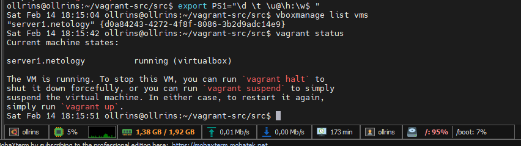
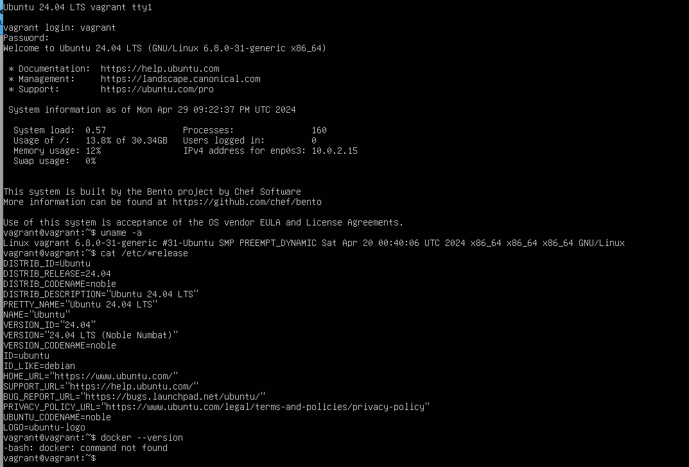
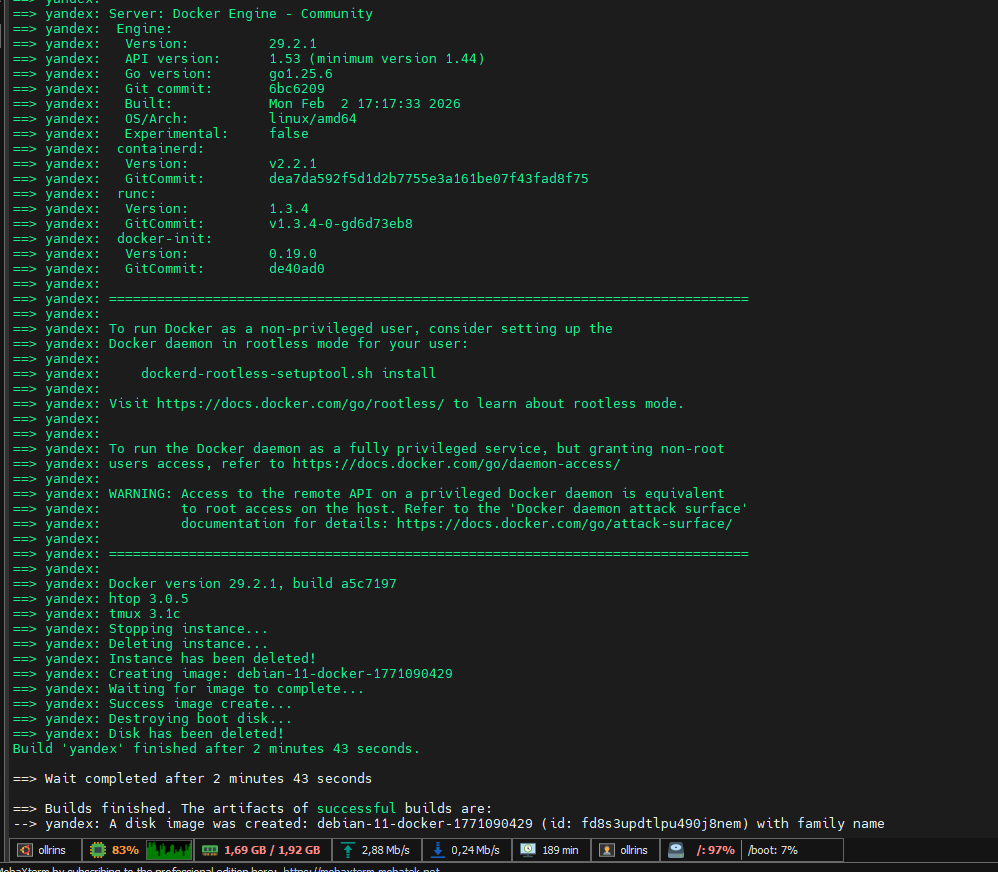
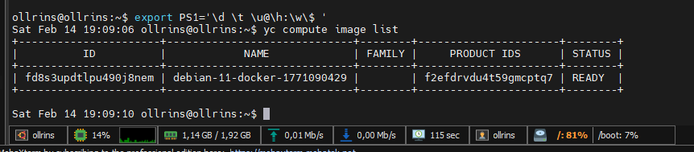
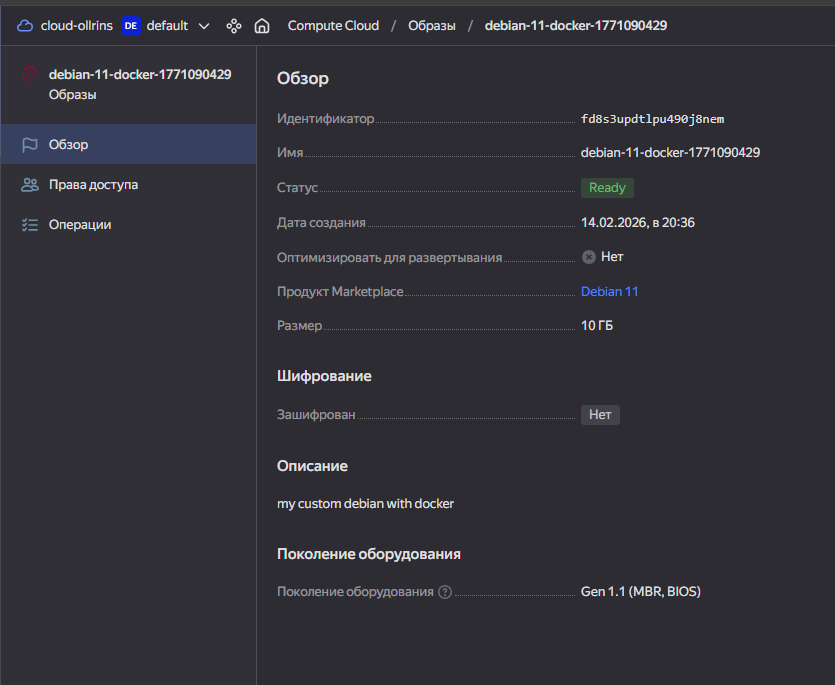
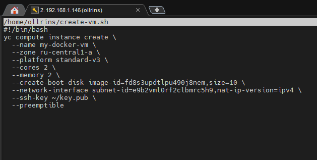
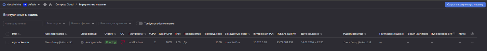
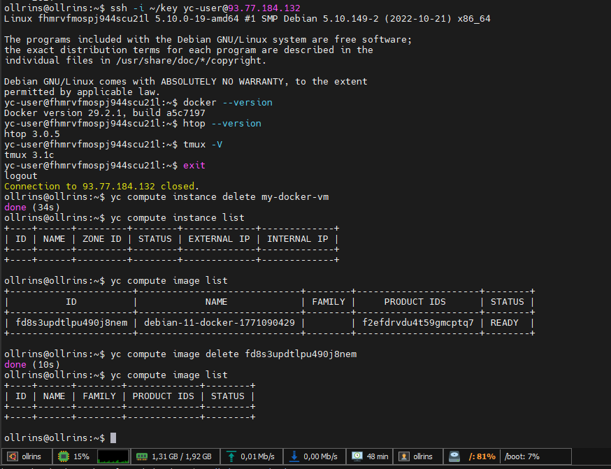

# Домашнее задание к занятию 2. «Применение принципов IaaC в работе с виртуальными машинами»


## Задача 1 

<p align="center">
  <br>
  
	<br>
  <em>Vagrant </em>
</p>

## Задача 2

<p align="center">
  
  <br>
  <em>Рисунок 1 - Виртуальная машина Virtualbox с помощью Vagrant и Vagrantfile. Машина создана, но файл-образ "bento/ubuntu-24.04, поэтому Docker не установлен, и в принципе ноутбук после apt-get update шумит и  тормозлит, мало ресурсов для вложенной виртуализации, оставлено как есть
</em>
</p>


## Задача 3

<p align="center">
  
  <br>
	  <em>Сборка образа Packer</em>
	  <br>
    
	 <br>
	  <em>Packer создал образ в Yandex Cloud</em>
	  <br>
  <br>
      
	 <br>
	  <em>Скриншот с сайта</em>
	  <br>
  <br>    
	 <br>
	  <em>Создание VM из файла</em>
	  <br>
  <br>
      
	 <br>
	  <em>Скриншот с сайта</em>
	  <br>
  <br>
      
  <br>
  <em>Подключене  к VM проверка версий Docker, htop и tmux, удаление VM</em>
</p>

<p align="center">
  <br>
  <em>mydebian.json</em>
</p>

<pre><code>{
    "builders": [
        {
            "type": "yandex",
            "token": "XXXXXXXXX",
            "folder_id": "XXXXXXXXX",
            "zone": "ru-central1-a",
            "image_name": "debian-11-docker-{{timestamp}}",
            "image_description": "my custom debian with docker",
            "source_image_family": "debian-11",
            "subnet_id": "e9b2vml0rf2clbmrc5h9",
            "use_ipv4_nat": true,
            "disk_type": "network-hdd",
            "ssh_username": "debian"
        }
    ],
    "provisioners": [
        {
            "type": "shell",
            "inline": [
                "sudo rm -f /etc/apt/sources.list.d/*backports*",
                "sudo rm -f /etc/apt/sources.list.d/*bullseye*",
                "sudo sed -i '/backports/d' /etc/apt/sources.list",
                "sudo apt-get update",
                "sudo apt-get install -y htop tmux",
                "curl -fsSL https://get.docker.com -o get-docker.sh",
                "sudo sh get-docker.sh",
                "sudo usermod -aG docker $USER",
                "docker --version",
                "htop --version",
                "tmux -V"
            ]
        }
    ]
}</code></pre>


## Часть 1. Установка необходимого ПО на хост-машину (Ubuntu 20.04)

1.1. Установка VirtualBox
```bash
sudo apt update
sudo apt install virtualbox -y
vboxmanage --version  # проверка
```
1.2. Установка Vagrant
```bash
sudo apt-get install vagrant -y
vagrant --version  # проверка
```
Часть 2. Работа с Vagrant (локальная виртуальная машина)
2.1. Создание структуры для Vagrant
```bash
mkdir -p ~/vagrant-src/src
cd ~/vagrant-src/src
```
2.3. Запуск и проверка Vagrant
```bash
vagrant up --provider=virtualbox
vagrant status
vagrant ssh
```
### Внутри ВМ:
```bash
docker --version
docker compose version
exit
```
### Остановка и удаление
```bash
vagrant halt
vagrant destroy -f
```

### Если возникают проблемы с VirtualBox
```bash
vagrant plugin install virtualbox
vagrant plugin list  # проверка установленных плагинов
```
### Дополнительно
```bash
vboxmanage list runningvms
vboxmanage list vms
vboxmanage controlvm "server1.netology" poweroff
```
1.3. Установка Packer
```bash
# Создание директории
mkdir -p ~/packer
```
### Скачивание Packer (версия 1.15.0)
```bash
wget https://hashicorp-releases.yandexcloud.net/packer/1.15.0/packer_1.15.0_linux_amd64.zip -P ~/packer
```
### Распаковка
```bash
unzip ~/packer/packer_1.15.0_linux_amd64.zip -d ~/packer
```
### Добавление в PATH
```bash
echo 'export PATH="$PATH:/home/ollrins/packer"' >> ~/.profile
exec -l $SHELL
```
### Проверка
```bash
packer --version
```
1.4. Настройка плагина Yandex для Packer
```bash
cd ~/packer
cat > config.pkr.hcl << 'EOF'
packer {
  required_plugins {
    yandex = {
      version = ">= 1.1.2"
      source  = "github.com/hashicorp/yandex"
    }
  }
}
EOF

packer init config.pkr.hcl
```
1.5. Установка Yandex Cloud CLI
```bash
curl -sSL https://storage.yandexcloud.net/yandexcloud-yc/install.sh | bash
exec -l $SHELL
```
1.6. Получение OAuth токена
Перейдите по ссылке и скопируйте токен

1.7. Настройка Yandex Cloud CLI
```bash
yc init
```
Проверка:

```bash
exec -l $SHELL
```
### Проверка настроек
```bash
yc config list
```
1.8. Создание SSH ключей
```bash
ssh-keygen -t ed25519
chmod 600 ~/key
chmod 644 ~/key.pub
```
## Часть 2. Работа с Packer (создание образа в Яндекс.Облаке)

2.1. Создание структуры для Packer
```bash
mkdir -p ~/packer/src
cd ~/packer/src
```
2.2. Создание файла конфигурации Packer
Файл ~/packer/src/mydebian.json:

2.3. Сборка образа
```bash
cd ~/packer
packer validate src/mydebian.json
packer build src/mydebian.json
```
2.4. Проверка созданного образа
```bash
yc compute image list
```
## Часть 3. Создание и проверка ВМ из образа
3.1. Создание скрипта для запуска ВМ
Файл ~/create-vm.sh:

```bash
cat > ~/create-vm.sh << 'EOF'
#!/bin/bash
IMAGE_ID=""  # заменить на ID
SUBNET_ID="" # заменить на вподсеть

yc compute instance create \
  --folder-id $Folder_ID \
  --name my-docker-vm \
  --zone ru-central1-a \
  --platform standard-v3 \
  --cores 2 \
  --memory 2 \
  --create-boot-disk image-id=$IMAGE_ID,size=10 \
  --network-interface subnet-id=$SUBNET_ID,nat-ip-version=ipv4 \
  --ssh-key ~/key.pub \
  --preemptible
EOF

chmod +x ~/create-vm.sh
```
3.2. Запуск ВМ
```bash
~/create-vm.sh
```
3.3. Получение информации о ВМ
```bash
yc compute instance get my-docker-vm --full | grep -A 5 ssh-keys
yc compute instance get my-docker-vm --full | grep -A 5 "one_to_one_nat"
```
3.4. Подключение к ВМ
```bash
ssh -i ~/key yc-user@<внешний-IP-адрес>
```
3.5. Проверка внутри ВМ
```bash
docker --version
docker compose version
htop --version
tmux -V
sudo docker run hello-world
exit
```
## Часть 4. Удаление ресурсов
4.1. Удаление ВМ
```bash
yc compute instance delete my-docker-vm
yc compute instance list  # проверка
```
4.2. Удаление образа
```bash
yc compute image delete $IMAGE_ID  # ваш ID образа
yc compute image list  # проверка
```
4.3. Удаление локальной Vagrant ВМ (если запущена)
```bash
cd ~/vagrant-src/src
vagrant destroy -f
```
Полезные команды для настройки окружения
Настройка промпта с временем
```bash
export PS1='\d \t \u@\h:\w\$ '
```
### Для постоянного использования добавить в ~/.bashrc
Поиск подсети
```bash
yc vpc subnet list --zone ru-central1-a --format table
```
Проверка всех версий
```bash
packer --version
vagrant --version
vboxmanage --version
yc --version
```
Важные моменты
Пользователь для подключения к ВМ - всегда yc-user
Права на ключи - приватный ключ (600), публичный (644)
Subnet ID -  yc vpc subnet list
Folder ID -  yc config list


```bash
ollrins@ollrins:~$ cat create-vm.sh
#!/bin/bash
yc compute instance create \
  --name my-docker-vm \
  --zone ru-central1-a \
  --platform standard-v3 \
  --cores 2 \
  --memory 2 \
  --create-boot-disk image-id=$IMAGE_ID,size=10 \
  --network-interface subnet-id=$Subnet_ID,nat-ip-version=ipv4 \
  --ssh-key ~/key.pub \
  --preemptible
```


